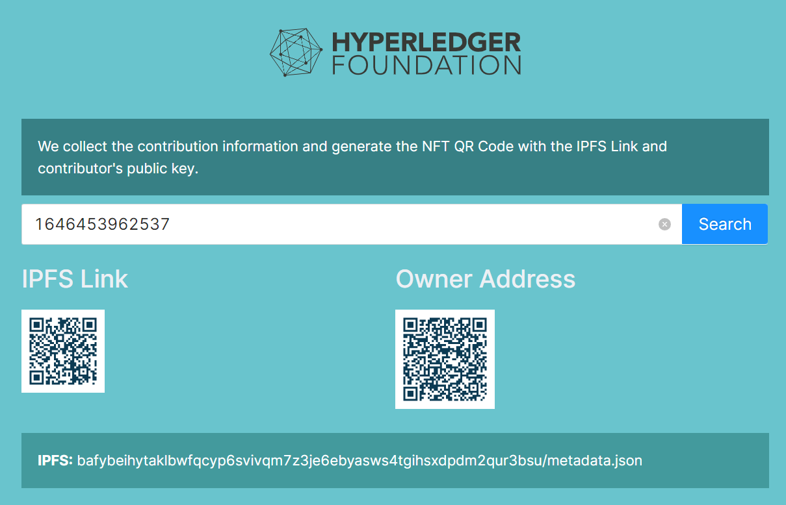

# NFT Community Footprint

## Call for volunteers

Contributions are welcome. Project Visions are listed at the bottom of this page.

Skill set
- Frontend/UI
- K8s related
- Fabric and/or other web3 tech, for ex, Ether 

### Status

The version includes the CLI Admin console APP and community ERC-721 chaincode. 

A priew of Front Page is listed below, which is in progress. 

## Description

- Open source projects with warm, welcoming communities keep people coming back for years. Many people form lifelong friendships through their participation in open source, whether at conferences or late night online chats. Contributors are like the blood of open source projects because they enable smaller projects to grow without a lot of financial support and they bring new ideas to their projects.

- We want to mint tokens for contributors' foot prints in the Fabric community. This can be an amazing experience. By this way, their contributions to open source can be like a reward and that becomes a part of communities in NFT.

### What should be minted?
mint for each code contribution when PR merged.
mint for open discussion or host online meetings.
mint for other contributions.

### Badge or "points" of person they have.
Invite them to do a developer show case.
Highlight on Global Forum.
Gifts(maybe sticker or something else).

## What is the vision?
Existing code in fabric ERC-721, ERC-1155 and newer standards. 
BSN in China
NEFERTI-Ecosystem
Others

### Borrow ideas from community
Identity solutions (Aries, Indy)
Integrating with payments (tokens etc.)
Decentralize infrastructure (middleware and contact points)
UX / UI - wallets
Sandboxes incorporating protocols and middleware
Interoperability
Security- more than just cryptography
What can we reuse